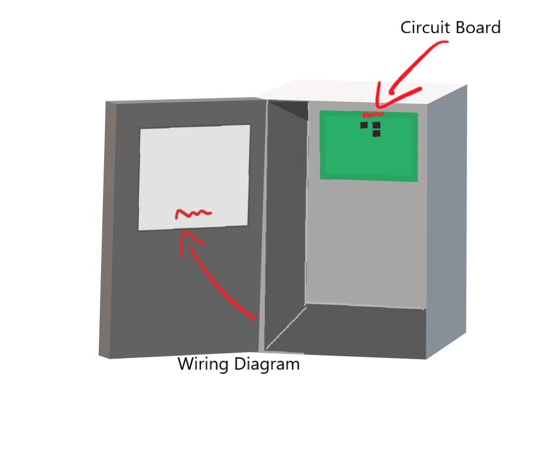
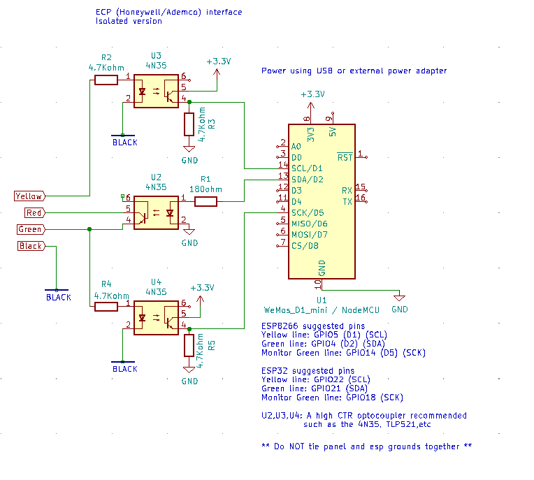
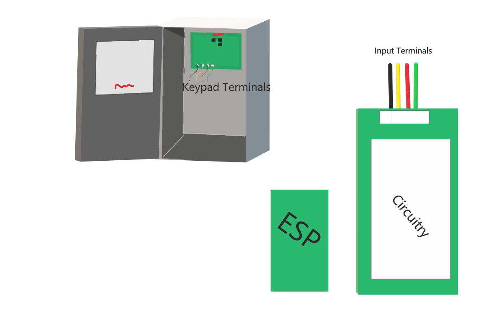
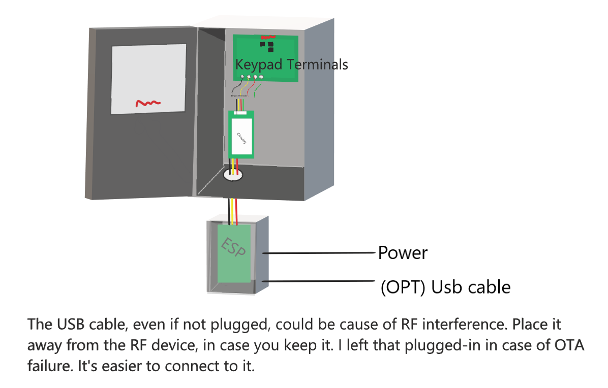
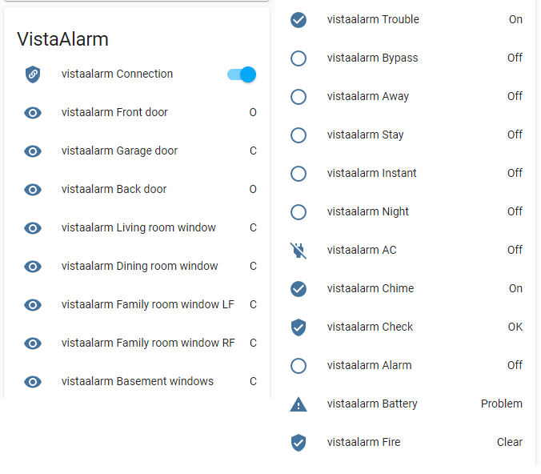

# Honeywell/Ademco Vista ECP ESPHome custom component and library

## Table of contents

- [Honeywell/Ademco Vista ECP ESPHome custom component and library](#honeywell-ademco-vista-ecp-esphome-custom-component-and-library)
  * [Table of contents](#table-of-contents)
  * [About the project](#about-the-project)
  * [Features](#features)
- [How to install](#how-to-install)
  * [⚠️ Warning!!! ⚠️](#⚠️-warning-⚠️)
  * [Prerequisites](#prerequisites)
    + [Identify Vista panel model](#identify-vista-panel-model)
  * [Project Structure and Wiring](#project-structure-and-wiring)
  * [Install ESPHome on the ESP device](#install-esphome-on-the-esp-device)
  * [Flash project into ESP device](#flash-project-into-esp-device)
    + [Language Adaptation](#language-adaptation)
      + [Option 1 (NEW)](#option-1--new-)
      + [Option 2 (OLD)](#option-2--old-)
  * [Connecting everything](#connecting-everything)
- [Miscellaneous](#miscellaneous)
  * [Example in Home Assistant](#example-in-home-assistant)
    + [Sample sensor configuration for card using mqtt](#sample-sensor-configuration-for-card-using-mqtt)
  * [HA Services](#ha-services)
  * [OTA updates](#ota-updates)
  * [MQTT integration](#mqtt-integration)
  * [Setting up the alarm panel keyboard card on HA](#setting-up-the-alarm-panel-keyboard-card-on-ha)
- [FAQ](#faq)
  * [Supported Models](#supported-models)
- [Report issue](#report-issue)
- [References](#references)
- [Author & Contributors](#author---contributors)

## About the project

This project allows you to monitor and control your old vista alarm panel over the internet through a cheap ESP device and an home automation platform such as Home Assistant or any other automation platform supporting the MQTT protocol.

If you like this project and wish to supplement my coffee intake, please click the button below to donate! Thank you!

[](https://www.buymeacoffee.com/Dilbert66)


Got a DSC PowerSeries panel? Have a look at the <a href="https://github.com/Dilbert66/esphome-dsckeybus">following project</a>.<br>

This is an implementation of an ESPHOME custom component and ESP Library to interface directly to a Safewatch/Honeywell/Ademco Vista 15/20 alarm system using the ECP interface and very inexpensive ESP32 modules .  The ECP library code is based on the arduino source code from Mark Kimsal's repository located at  https://github.com/TANC-security/keypad-firmware.  It has been  completely rewritten as a class and adapted to work on the ESP platform using interrupt driven communications and pulse timing. A custom modified version of Peter Lerup's ESPsoftwareserial library (https://github.com/plerup/espsoftwareserial) was also used for the serial communications to work more efficiently within the tight timing of the ESP interrupt window. 

The panel sends various cmd packets such as the F7 (LCD display and status updates), FA (zone extenders, relay modules), FB (RF devices) and F2 (AUI touch screen diplays), F9 (Long range radio) and F6 (send keystrokes and cms).  These data cmds are used to capture all statuses from the panel as well as send keystrokes and cmds to the panel.

As far as writing on the bus and the request to send pulsing sequence, most documentation only discusses keypad traffic and this only uses the the 3rd pulse.  In actuality the pulses are used as noted below depending on the device type requesting to send:
```
Panel pulse 1. Addresses 1-7, expander board (07), etc
Panel pulse 2. Addresses 8-15 - zone expanders, relay modules
Panel pulse 3. Addresses 16-23 - keypads
```
For example, a zone expander that has the address 07, will send it's address on the first pulse only and will send nothing for the 2nd and 3rd pulse.  A keypad with address 16, will send a 1 bit pulse for pulse1 and pulse2 and then it's encoded address on pulse 3. This info was determined from analysis using a zone expander board and Pulseview to monitor the bus. 

If you are not familiar with ESPHome , I suggest you read up on this application at https://esphome.io and home assistant at https://www.home-assistant.io/.   The library class itself can be used outside of the esphome and home assistant systems.  Just use the code as is without the vistalalarm.yaml and vistaalarm.h files and call it's functions within your own application.  

This library is designed around the "external components" feature of ESPHome (https://esphome.io/components/external_components.html).  The previous version of this library was using the older "custom components" feature which is being deprecated.  Using external components is a much better alternative and allows for much easier install and customization.

To install, first copy the VistaAlarm.yaml file from here to your esphome directory. You can then edit it either directly or using the ESPHome dashboard to match your alarm panel setup.  The yaml is self explanatory.  Secondly, for the main library support code you have two choices:

 1: You can leave the yaml external_components source line uncommented and it will automatically fetch the required code from my esphome-components repository.  
 
 or alternatively:
 
 2: If you prefer a more manual approach, you can comment out the github source line and uncomment the source "my_components" line.  You will then need to create a matching my_components directory in your esphome home path.  Name it anything you like as long as it matches the source line in the yaml.  You then copy all content from the "components" directory located in repository https://github.com/Dilbert66/esphome-components/tree/main/ to this new directory.  Please note that for any future updates, you will again need to manually copy the files from the components repository to your esphome folder.

For multi partition support, it is important that you first program new keypad addresses assigned to each partiton you want to support using programs `*190` - `*196` on the vista panel.  Once done, assign these addresses to keypadaddr1 (partition1) , keypadaddr2 (partition2), keypaddr3 (partition3).  For unused partitions, leave the associated keypadaddrx config line at 0. 

##### Notes: 

* If you use the zone expanders and/or LRR functions, you might need to clear CHECK messages for the LRR and expanded zones from the panel on boot or restart by entering your access code followed by 1 twice. eg 12341 12341 where 1234 is your access code.

**Read more in the next wiki paragraphs for a detailed step by step guide.**

## Features


* Full zone expander emulation (4219/4229) which will give you  an additional 8 zones to the system per emulated expander plus associated relay outputs. Currently the library will provide emulation for 2 boards for a total of 16 additionals zones. You can even use free pins on the chip as triggers for those zones as well. 

* Full independent partition support. The firmware allows control and view status of all 3 partitions.

* Relay module emulation. (4204). The system can support 4 module addresses for a total of 16 relay channels. 

* Long Range Radio (LRR) emulation (or monitoring) statuses for more detailed status messages

* Zone status - Open, Alarmed, Closed and Bypass with named zones

* Arm, disarm or send any sequence of commands to the panel for any partition

* Status indicators - fire, alarm, trouble, armed stay, armed away, instant armed, armed night,  ready, AC status, bypass status, chime status,battery status, check status, zone and relay channel status field of individual partitions.


* Optional ability to monitor other devices on the bus such as keypads, other expanders, relay boards, RF devices, etc. This requires the #define MONITORTX to be uncommented in vista.h as well as the addition of two resistors (R4 and R5) to the circuit as shown in the schematic.   This adds another serial interrupt routine that captures and decodes all data on the green tx line.  If enabled this data will be used to update zone statuses for external modules.


The following services are published to home assistant for use in various scripts. 
```
alarm_disarm: Disarms the alarm with the user code provided, or the code specified in the configuration.
alarm_arm_home: Arms the alarm in home mode.
alarm_arm_away: Arms the alarm in away mode.
alarm_arm_night: Arms the alarm in night mode (no entry delay).
alarm_trigger_panic: Trigger a panic alarm.
alarm_trigger_fire: Trigger a fire alarm.
alarm_keypress: Sends a string of characters to the default partition. (Controlled by the keypad1 address)
alarm_keypress_partition: Sends a string of characters to any specified partition. (1, 2 or 3)
```

# How to install

## ⚠️ Warning!!! ⚠️

⚠️ **When opening the panel and dealing with the alarm panel itself throughout the reading of this wiki be careful as AC current is used to power the panel, make sure to switch it off before touching the terminals or any other part of the circuits.** ⚠️

##  Prerequisites

In order to install the project you need to:
- [Identify your Vista alarm panel model](#identify-vista-panel-model)
- Make sure to have a running instance of Home Assistant or any other home automation platform supporting MQTT protocol (or something else, but able to listen and publish on MQTT topics) // TO BE CHECKED
- [Get the needed components for the project and wire them](#project-structure-and-wiring)
- [Install ESPHome on the ESP device](#install-esphome-on-the-esp-device)
- Flash the project on the ESP device
- [Connect everything](#connecting-everything)


### Identify Vista panel model
Open the panel and check the interior side of the panel's door, there should be the wiring diagram indicating the Vista model right below (usually on bottom right or center). <br>

*Example: Vista-20P, Vista-20SE, Vista-20SEa, Vista-25IT, ...*<br>

If the wiring diagram is not present, check the circuit board. You should be able to see what model it is by looking either at the stamps/labels on the circuit board or by looking at the model on the CPU. The model here sometimes is in form of "SAVS**20P**5" or similar.<br> It is recommended to check also the circuit board even if you found the model on the wiring diagram, just to be sure that they match.

See image below, red arrows indicates where it could be.



Check [Supported Models](#supported-models) to get an overview of compatible models and continue to next section. 

If your device is not present in the list you could still try using one of the code versions available in the repository, **but the functioning is not guaranteed**.

Got a DSC PowerSeries panel? Have a look at the <a href="https://github.com/Dilbert66/esphome-dsckeybus">following project</a>.

##  Project Structure and Wiring

After you identified the vista panel's model then you can start preparing for the hardware part and the first HW part you need to get is an ESP device. In this case, it's highly
recommended that an ESP32 be used due to it's dual processor and increased available ram.<br>

Let's analyze the project structure.<br>

Currently the project is structured as follows:
- `master` branch: stable code - **recommended**
- `dev` branch: more updated code with new features, but WIP - **stability and functioning are not guaranteed**

For both branches you have the possibility to install them using Home Assistant or MQTT.<br>

If you have an Home Assistant instance running and you want to be able to fully control and monitor the panel through HA you will have to use the ESPHome yaml files for Home Assistant inside `src` folder. <br>

If instead you don't want to use Home Assistant, you can still use the component source code above, but you will have to use the sketch files inside the `MQTT-Example` folder and setup your home control software to process the MQTT topics.<br> // TO BE CHECKED

Select the branch and configuration/source code files you need.<br>

If you're unsure on what ESP model you need to get, then you can document at <a href="https://esphome.io/">ESPHome website</a>. *In theory*, any ESP device should work with ESPHome. Just make sure you have the GPIO numbers pin mapping, sometimes the pins don't match the ones reported in the pcb's silkscreen.<br>
*Example for the Wemos D1 R2 -> <a href="https://cyaninfinite.com/getting-started-with-the-wemos-d1-esp8266-wifi-board/">link</a>*

Now that you identified the panel, selected a source code and got an ESP device, it's time to choose a wiring configuration to the panel.

I've provided various working versions to fit within builders available parts or requirements.  None of these circuits need a pcb and can easily be built using point to point soldering on a proto board.

1. Non-isolated simple version.  Small parts count but resistor values are important.  Signal levels are dependent on components used. Output pulse will not be optimal due to optocoupler use.


2. Alternative version using transistors for both signal input and output.  Benefits are that signal quality will be optimal for both input and output. Resistor values are not critical. 
  Please note though that you have to configure your esphome yaml config accordingly to account for the signal inversion of this design. The other designs use the default settings.
YAML config:
```
  invert_mon: "false"
  invert_rx: "false"
  invert_tx: "false"
  input_mode_rx: INPUT_PULLDOWN
  input_mode_mon: INPUT_PULLUP
```


3. Simple version using transistors instead of an optocoupler for output but still using resistor dividers for signal input.


4. Ground isolated version



Notes: This version is the least recommended as it will load the ECP bus to a certain extent. It also does not provide the best signal output. This is all dependant on the bus it is connected to and the quality of the optocouplers used. Your mileage may vary.<br><br>
* Optocouplers should have a minimum CTR of 50. Recommendations are the 4N35 or TLP521. You can vary the resistor values for the simple version but keep the ratio similar for the voltage dividers R2/R3 and R4/R5. R1 should not be set below 150 ohm or 100ohm when using an ESP32. Resistor values are chosen to minimize load on ECP bus while still providing full output signals on the optocouplers. <br>
* My goal was to keep the design as simple as possible without causing any bus load or interference with maximum signal fidelity.  Since the transmit circuit required high side switching I opted to use an optocoupler since I had a few on hand and it simplified the amount of components needed but proved to have it's own issues as far as CTR requirements.  <br>

Read the notes on the drawings for more details.

Get the other components: 
- breadboard or PCB (if you prefer soldering)
- jumper cables
- 4-inputs screw terminal for the cables from the panel to the ESP (opt)
- resistors (you can use multiple resistors in series or parallel if you can't find kits with the exact value of the diagrams, i.e. 4.7KOhm can be obtained by using two resistors in parallel -> 100kohm + 5.1kohm =~ 4.8KOhm)
- optocouplers / transistors
- power supply or USB for the ESP device (highly recommended) or a 12V to 5V/3.3V regulator (to take the power from the panel)
- juction box (optional, to protect the ESP device if installed outside the panel)

Thanks to <a href="https://community.home-assistant.io/u/howardchen3">`@howardchen3`</a> there is a PCB layout of the ground-isolated version available at <a href="https://oshwlab.com/boobeechen/vistaesphome_copy">oshwlab</a> that could be used to send to a manufacturer. Read more on the site.


Wire the breadboard/PCB part according the wiring diagram you selected, but for the moment keep the ESP unplugged from both panel and breadboard/pcb since we're going to connect the ESP to the PC and it's not handy to have all the wires around. 

You should be in a situation like this now:


Esp is ready to be connected to the PCB/breadboard and the latter is ready to be connected at the panel.<br>
⚠️ **DO NOT CONNECT THEM YET** ⚠️

**Very important step**: Double check that the connections are ok (add some black tape to keep the loose connections in place if you opted for a breadboard). It is difficult to debug for HW problems once phisically attached to the panel or near to it as often the panels are not in comfy locations.

##  Install ESPHome on the ESP device
// TO BE CHECKED

This paragraph covers only the installation of the software that interacts with Home Assistant and ESPHome.

Connect the ESP device to the PC. Make sure you have the right drivers (CP2102 (square chip) or CH341 -> <a href="https://esphome.io/guides/physical_device_connection.html">ESPHome - physical device connection</a>) installed on your PC or ESPHome will not be able to recognize it.

Now you have two options:
1. Install a basic version of ESPHome on the ESP device (thorugh command line esphome or web.esphome.io) and then adopt it on ESPHome of your HA instance (in order to install right after the needed software over the air) **OR**
2. Install the final project on the device by using the ESPHome addon on HA (might be required to connect the ESP on the PC that is running HA)

Before proceeding with any of the two options, make sure to identify the right board and framework (opt) for your ESP device. Check the ESPHome website for more info.<br>

## Connecting everything 

⚠️ **Before continuing read [Warning notice](#⚠️-warning-⚠️)** ⚠️

Let's connect the ESP device to the breadboard or PCB and finally let's connect the breadboard/PCB to the panel. Depending on the configuration you selected, you need to connect the breadboard/PCB to the same keypad terminals of your existing physical keyboard **OR**, if you prefer, on the keypad terminals of another partition of your panel (in case of multi-partition panel).

**Make sure to keep the ESP device further from any RF receiver as the components and the ESP itself could cause interference.**

Power up the ESP device and check on Home Assistant. In a minute or so it should be ready and accessible from HA > ESPHome.

Ping the device address if having problems and double check the `project_config.yaml` file.

**Optional steps**

Cover the ESP device with a junction box or similar just to make a cover. Remember to keep at least two holes for some air venting.

Final result:



Note: Even the circuitry can be placed outside if you want. The wires from circuitry to the ESP are just for demo purposes, not related at all to the wiring diagrams. The power wire depends on the setup you chose, but it's recommended to have an external power supply.

# Miscellaneous
## Example in Home Assistant
#Note: The config below assumes an ESPHOME device named: "vistaalarm". Change the lines below to suit your own device name.


The returned statuses for Home Assistant are: armed_away, armed_home, armed_night, pending, disarmed,triggered and unavailable.  

Sample Home Assistant Template Alarm Control Panel configuration with simple services (defaults to partition 1):

```yaml
alarm_control_panel:
  - platform: template
    panels:
      safe_alarm_panel:
        name: "Alarm Panel"
        value_template: "{{states('sensor.vistaalarm_system_status')}}"
        code_arm_required: false
        
        arm_away:
          - service: esphome.vistaalarm_alarm_arm_away
                  
        arm_home:
          - service: esphome.vistaalarm_alarm_arm_home
          
        arm_night:
          - service: esphome.vistaalarm_alarm_arm_night
            data_template:
              code: '{{code}}' #if you didnt set it in the yaml, then send the code here
          
        disarm:
          - service: esphome.vistaalarm_alarm_disarm
            data_template:
              code: '{{code}}'                    
```

##  HA Services
Note:  The services for the HA API  will show up as esphome.<yourdevicename>.<servicenamefromlistbelow>
- Basic alarm services. These services default to partition 1:

	- "alarm_disarm", Parameter: "code" (access code)
	- "alarm_arm_home" 
	- "alarm_arm_night", Parameter: "code" (access code)
	- "alarm_arm_away"
	- "alarm_trigger_panic"
	- "alarm_trigger_fire"


- Intermediate command service. Use this service if you need more versatility such as setting alarm states on any partition:

	- "set_alarm_state",  Parameters: "partition","state","code"  where partition is the partition number from 1 to 8, state is one of "D" (disarm), "A" (arm_away), "S" (arm_home), "N" (arm_night), "P" (panic) or "F" (fire) and "code" is your panel access code (can be empty for arming, panic and fire cmds )

- Generic command service. Use this service for more complex control:

	- "alarm_keypress",  Parameter: "keys" where keys can be any sequence of keys accepted by your panel. For example to arm in night mode you set keys to be "xxxx33" where xxxx is your access code. 
    
	- "alarm_keypress_partition",  Parameters: "keys","partition" where keys can be any sequence of keys accepted by your panel and partition is  1 - 3. For example to arm in night mode  on partition 1 you set keys to be "xxxx33" and partition to be "1"  where xxxx is your access code.     
    
  - "set_zone_fault",Parameters: "zone","fault" where zone is a zone from 9 - 48 and fault is 0 or 1 (0=ok, 1=open)
      The zone number will depend on what your expander address is set to.

## OTA updates

In order to make OTA updates, it is recommended that the connection switch in the frontend be switched to OFF since the  ECP library is using interrupts and could cause issues with the update process.

## MQTT Support
If you would like to use MQTT communications with Homeassistant or alternatively use ESPHOME with other platforms that can support MQTT, you can modify the configuration to use the MQTT protocol instead of the native HA API integration.  This simply involves the addtion of an mqtt: configuration section in the yaml and to remove the api: section.   Please see the ESPHOME MQTT documentation more details: https://esphome.io/components/mqtt.html .  For an example on how to configure the alarm-panel-card to use MQTT services, please see the lovelace.yaml file.  

Command topic is "&lt;yoursystemnameinesphome&gt;/alarm/set"
	
Command payload for sending key commands: {"keys":"&lt;sequenceofkeys&gt;","partition":&lt;partition#&gt;}
	
Command payload to set an expander fault status: {"zone":&lt;zone#&gt;,"fault":&lt;on:off or 0:1&gt;}
	
Command payload to set an alarm state: {"state":"&lt;alarmstate&gt;","partition":&lt;partition#&gt;,"code":"&lt;accesscode&gt;"} - see set_alarm_state api command above for more details

Sensor data will follow the HA MQTT discovery format. See here for details: https://www.home-assistant.io/docs/mqtt/discovery/

If you prefer to use Arduino instead of ESPHome, I've also provided an Arduino example sketch in the mqtt_example folder.  Follow the instructions at the top of the file.

### Sample sensor configuration for card using mqtt.
Note, in this example the ESPHOME device name is "vistaalarm". Please change the lines below to match your own device name and field id's.

```yaml
# Partition 1 topics

mqtt:
  sensor:
    - name: "displayline1"
      state_topic: "vistaalarm/sensor/line1__ln1_1/state

    - name: "displayline2"
      state_topic: "vistaalarm/sensor/line2_ln2_1/state"

    - name: "vistaaway"
      state_topic: "vistaalarm/binary_sensor/away_partition_1/state"

    - name: "vistastay"
      state_topic: "vistaalarm/binary_sensor/stay_partition_1/state"

    - name: "vistaready"
      state_topic: "vistaalarm/binary_sensor/ready_partition_1/state"

    - name: "vistatrouble"
      state_topic: "vistaalarm/binary_sensor/trouble_partition_1/state"

    - name: "vistabypass"
      state_topic: "vistaalarm/binary_sensor/bypass_partition_1/state"

    - name: "vistachime"
      state_topic: "vistaalarm/binary_sensor/chime_partition_1/state"
      
    - name: "vistabeeps"
      state_topic: "vistaalarm/sensor/beeps_partition_1/state"    

    - name: "vistaac"
      state_topic: "vistaalarm/binary_sensor/ac_status/state" 

    - name: "vistabattery"
      state_topic: "vistaalarm/binary_sensor/battery_status/state"
      
    - name: "Front Door"
      state_topic: "vistaalarm/binary_sensor/front_door_z1/state"       

```


##  Setting up the alarm panel keyboard card on HA

I've added a sample lovelace alarm-panel card copied from the repository at https://github.com/GalaxyGateway/HA-Cards. I've customized it to work with this ESP library's services.   I've also added two new text fields that will be used by the card to display the panel prompts the same way a real keypad does. To configure the card, just place the `alarm-keypad-card.js` and `*.mp3` files from the ha_keypad_card folder into the `/config/www` directory of your homeassistant installation and add a new resource in your lovelace configuration pointing to `/local/alarm-keypad-card.js`. <br>
Add a reference to alarm-keypad-card.js in Lovelace. There’s two way to do that:<br>
1. Using UI:  go to settings (cog icon bottom left in sidebar menu), click on 'dashboards', click on top right 3 dots option then on Resources,
  bottom right 'add resource' option, in window, paste the url as '/local/alarm-keypad-card.js?id=1', select javascript module.

3. Using YAML: Add following code to lovelace section

```yaml
resources:
- url: /local/alarm-keypad-card.js?id=1
  type: module
```
*** NOTE *** :  Every time you update this file, you will need to increase the id=xx number in the url by 1 in order to force the browser to reload it.

You can then configure the card as shown below. Just substitute your service name to your application and choose one of the two chunks.

The first example is for using the esphome component in a multi partition environment.  The second uses MQTT.  The MQTT example can also support multiple partitions. 
Simply add "partition":xx in the json payload to select the desired partion where xx is the partition number.  If you don't enter a partition value, the default partition of 1 will be used.

```yaml
# EX1 - Partition 1 example - HA
type: custom:alarm-keypad-card
title: Vista_ESPHOME-partition1
disp_line1: sensor.vistaalarmtest_line1
disp_line2: sensor.vistaalarmtest_line2
service_type: esphome
service: vistaalarm_alarm_keypress_partition
status_A: AWAY
status_B: STAY
status_C: READY
status_D: BYPASS
status_E: TROUBLE
status_F: CHIME
status_G: ""
status_H: ""
sensor_A: binary_sensor.vistaalarmtest_away
sensor_B: binary_sensor.vistaalarmtest_stay
sensor_C: binary_sensor.vistaalarmtest_ready
sensor_D: binary_sensor.vistaalarmtest_bypass
sensor_E: binary_sensor.vistaalarmtest_trouble
sensor_F: binary_sensor.vistaalarmtest_chime
button_A: STAY
button_B: AWAY
button_C: BP LIST
button_D: BYPASS
button_F: null
button_G: ""
button_E: ""
button_H: DISARM
status_C_off_icon: mdi:circle-off-outline
status_C_on_icon: mdi:check-circle
status_C_color: green
status_E_color: orange
status_E_on_icon: mdi:alert
status_E_off_icon: mdi:triangle-outline
status_B_color: red
status_B_on_icon: mdi:shield-lock
status_B_off_icon: mdi:shield-off-outline
status_A_color: red
status_A_on_icon: mdi:shield-lock
status_A_off_icon: mdi:shield-off-outline

#all style settings are optional. These are the default colors
style:
  "--lcdbgcolordark": var(--input-fill-color)
  "--lcdtextcolordark": var(--primary-text-color)
  "--buttonbgcolordark": var(--input-fill-color)
  "--buttontextcolordark": var(--primary-color)
  "--buttonhovercolordark": var(--outline-hover-color)
  "--buttonactivecolordark": var(--secondary-text-color)
  "--sensorlabelcolordark": var(--accent-color));
  "--buttonfocuscolordark": var(--outline-color)
  "--sensoroffcolordark": var(--disabled-text-color)
  "--bordercolordark": var(--disabled-color)

  "--sensoroffcolorlight": var(--disabled-text-color)
  "--lcdbgcolorlight": var(--input-fill-color)
  "--lcdtextcolorlight": var(--primary-text-color)
  "--sensorlabelcolorlight": var(--accent-color));
  "--buttonbgcolorlight": var(--input-fill-color)
  "--buttontextcolorlight": var(--primary-color)
  "--buttonhovercolorlight": var(--outline-hover-color)
  "--buttonactivecolorlight": var(--secondary-text-color)
  "--buttonfocuscolorlight": var(--outline-color)
  "--bordercolorlight": var(--disabled-color)

cmd_A:
  keys: "12343"
  partition: 1
cmd_B:
  keys: "12342"
  partition: 1
cmd_C:
  keys: 1234600
  partition: 1
cmd_D:
  keys: 12346#
  partition: 1
cmd_E:
  keys: A
  partition: 1
cmd_H:
  keys: 12341
  partition: 1
cmd_F:
  keys: <
  partition: 1
cmd_G:
  keys: ">"
  partition: 1
key_0:
  keys: "0"
  partition: 1
key_1:
  keys: "1"
  partition: 1
key_2:
  keys: "2"
  partition: 1
key_3:
  keys: "3"
  partition: 1
key_4:
  keys: "4"
  partition: 1
key_5:
  keys: "5"
  partition: 1
key_6:
  keys: "6"
  partition: 1
key_7:
  keys: "7"
  partition: 1
key_8:
  keys: "8"
  partition: 1
key_9:
  keys: "9"
  partition: 1
key_star:
  keys: "*"
  partition: 1
key_pound:
  keys: "#"
  partition: 1
text_1: "OFF"
text_2: AWAY
text_3: STAY
text_4: MAX
text_5: TEST
text_6: BYPASS
text_7: INSTANT
text_8: CODE
text_9: CHIME
text_star: READY
text_pound: ""
text_0: ""
scale: 1
button_disabled_A: false
button_disabled_B: false
button_disabled_C: false
button_disabled_D: false
button_disabled_E: true
button_disabled_F: true
button_disabled_G: true
button_disabled_H: true
beep: sensor.vistaalarmtest_beeps
view_pad: true
view_display: true
view_status: true
view_status_2: true
view_bottom: false
button_left: false
vibration_duration: 5

```

```yaml
# EX2 - Partition 1 example - MQTT

type: 'custom:alarm-keypad-card'
title: Vista_MQTT
unique_id: vista1
disp_line1: sensor.displayline1
disp_line2: sensor.displayline2
scale: 1
service_type: mqtt
service: publish
status_A: AWAY
status_B: STAY
status_C: READY
status_E: BYPASS
status_D: TROUBLE
status_F: ''
status_G: ''
status_H: ''
sensor_A: sensor.vistaaway
sensor_B: sensor.vistastay
sensor_C: sensor.vistaready
sensor_E: sensor.vistabypass
sensor_D: sensor.vistatrouble
button_A: STAY
button_B: AWAY
button_C: DISARM
button_D: BYPASS
cmd_A:
  topic: Vista/Set
  payload: '{"keys":"12343","partition":"1"}
cmd_B:
  topic: Vista/Set
  payload: '{"keys":"12342","partition":"1"}
cmd_C:
  topic: Vista/Set
  payload: '{"keys":"12341","partition":"1"}
cmd_D:
  topic: Vista/Set
  payload: '{"keys":"12346#","partition":"1"}
key_0:
  topic: Vista/Set
  payload: '{"keys":"0","partition":"1"}
key_1:
  topic: Vista/Set
  payload: '{"keys":"1","partition":"1"}
key_2:
  topic: Vista/Set
  payload: '{"keys":"2","partition":"1"}
key_3:
  topic: Vista/Set
  payload: '{"keys":"3","partition":"1"}
key_4:
  topic: Vista/Set
  payload: '{"keys":"4","partition":"1"}
key_5:
  topic: Vista/Set
  payload: '{"keys":"5","partition":"1"}
key_6:
  topic: Vista/Set
  payload: '{"keys":"6","partition":"1"}
key_7:
  topic: Vista/Set
  payload: '{"keys":"7","partition":"1"}
key_8:
  topic: Vista/Set
  payload: '{"keys":"8","partition":"1"}
key_9:
  topic: Vista/Set
  payload: '{"keys":""9,"partition":"1"}
key_star:
  topic: Vista/Set
  payload: '{"keys":"*","partition":"1"}
key_pound:
  topic: Vista/Set
  payload: '{"keys":"#","partition":"1"}
text_1: 'OFF'
text_2: AWAY
text_3: STAY
text_4: MAX
text_5: TEST
text_6: BYPASS
text_7: INSTANT
text_8: CODE
text_9: CHIME
text_star: READY
text_pound: ''
text_0: ''  
view_pad: true
view_display: true
view_status: true
view_status_2: true
view_bottom: false
button_left: false
beep: sensor.vistabeeps
vibration_duration: 5
```


# FAQ

1. How do I use the Trace Analyzer for deeper investigation?

Connect the pulseview channel D0 to the yellow line input on the D1 ESP input pin and the pulseview channel D1 to the green line monitor input D5 pin on ESP and then finally ground to the common ground on the ESP side. You don't need to monitor VCC or the ESP D2 output since that will also be seen on the green line monitor input at D5. Make sure you don't connect the channel inputs to any voltage higher than around 5 volts.

You should not be sharing ground between the panel and the esp if you used the optocoupler isolated schematic to build your circuit. if you did, it won't hurt anything, it's just not needed.

The setup file is really just the decoder setup so you that you can actually see the data being sent. It's attached below.
Just unzip it and load it into PulseView software by selecting "Restore session setup" from the menu. Ensure you connect your device first before running PulseView so that it picks it up on start up. (it will show up as a Saelea 8 channel). Once it starts your session, you will see 8 inputs. Once you restore the saved session setup, you will see 3 channels and 2 decoders. One for the panel (yellow line) and one for the keypad (green line). You'll need to run the capture twice to actually capture data. Seems like the first time after loading a session, it does not see the channels but the second run is fine.

<a href="https://github.com/Dilbert66/esphome-vistaECP/files/7150101/vistaecp2.zip">vistaecp2.zip</a>

Once you have about 1 minute or so of data you can then click the save button to save the session. It will create an *.sr file.
zip that and attach it to the issue.

### sample sensor configuration for card using mqtt

2. What is LRR?

LRR = Long Range Radio. IP or GSM interface and monitored by a central monitoring station.

3. What is an address?

A zone number. Zone number = Address. //TO BE CHECKED

4. How do I setup the expanders?

// TO BE CHECKED

5. What is the access code?

Your 4 digit secret number to arm/disarm the system. e.g. 1234

6. What is quickArm?

It will the hashtag instead of your access code for the arm command. E.g. it will send #3 instead of 12343 to enable "stay" mode.

7. What is RFMsg?

It is a string variable that will be populated with the messages from your RF devices, if any. Read more in the yaml configuration section (rfSerialLookup).<br>
In general, the RF message will contain the serial number and a status byte (with the sensor data).<br>
```
  bit 1 - ?
  bit 2 - Battery (0=Normal, 1=LowBat)
  bit 3 - Heartbeat (Sent every 60-90min) (1 if sending heartbeat)
  bit 4 - ?
  bit 5 - Loop 3 (0=Closed, 1=Open)
  bit 6 - Loop 2 (0=Closed, 1=Open)
  bit 7 - Loop 4 (0=Closed, 1=Open)
  bit 8 - Loop 1 (0=Closed, 1=Open)
```
// TO BE CHECKED

8. How do I open an issue?

See [How to](#report-issue) section.

```

## Supported Models

As of today:

|  **Model** |  **Source Code**  |
|:----------:|:-----------------:|
| Vista 20P  | vistaEcpInterface |
| Vista 20SE | vista20SE         |
| Vista 25IT | vista20SE         |
| Vista120 | vistaEcpInterface - // TO BE CHECKED |
| Vista128bpt/250bpt | vistaEcpInterface - // TO BE CHECKED |
| | |
| | |
| | |
| | |


# Report issue

First: search for your issue into the closed and open issues in the repo, if you don't find anything, open a new issue specifying:<br>
- Panel Model
- Used ESP model
- Used wiring diagram
- YAML config (the necessary parts)
- Issue
- Installed sensors (if relevant)
- What you've tried
- Logs

# References

## References 

You can checkout the links below for further reading and other implementation examples. Some portions of the code in the repositories below was used in creating the library.
* https://github.com/TANC-security/keypad-firmware
* https://github.com/cweemin/espAdemcoECP
* https://github.com/TomVickers/Arduino2keypad/

This project is licensed under the `Lesser General Public License` version `2.1`, or (at your option) any later version as per it's use of other libraries and code. Please see `COPYING.LESSER` for more information.

# Author & Contributors

- @Dilbert66 (Author)
- @appleguru (Contributor)
- @nitej (Contributor)
- @rcmurphy (Contributor)
- @jdev-homeauto (Contributor)
- @lorenzodeveloper (Contributor)
